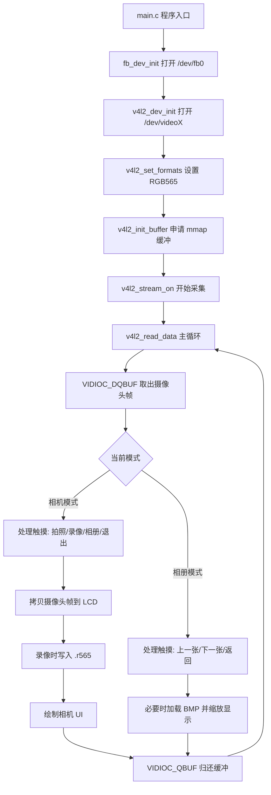

# UI 相机工程学习教程

版本：V1.0  
适用工程：`v4l2_camera`  
适用平台：Linux framebuffer + V4L2 摄像头 + Linux input 触摸屏  
目标读者：已经能让摄像头数据显示到 LCD，希望系统理解“UI 相机”完整工程的新手

---

## 文档更新说明

| 版本 | 说明 | 日期 |
| --- | --- | --- |
| V1.0 | 按正点原子教程风格整理 UI 相机工程，覆盖构建、运行、模块原理、代码逻辑和调试方法。 | 2026-04-28 |

---

## 前言

这个工程不是 Qt 程序，也不是 OpenCV 程序，而是一个更接近裸 Linux 应用层开发的相机程序。它直接操作三个 Linux 设备接口：

| 设备接口 | 设备节点示例 | 工程中负责模块 | 作用 |
| --- | --- | --- | --- |
| framebuffer | `/dev/fb0` | `lcd/` | 把像素直接写到 LCD 显存 |
| V4L2 | `/dev/video1` | `v4l2/` | 从摄像头采集图像帧 |
| input event | `/dev/input/event0` | `input/` | 读取触摸屏坐标 |

所以学习这个项目，核心不是先学“界面库”，而是先搞懂下面这条主线：

```text
摄像头采集一帧 RGB565 图像
        ↓
程序从 V4L2 队列取出这一帧
        ↓
把这一帧拷贝到 framebuffer 显存
        ↓
在同一块显存上画 UI 按钮
        ↓
读取触摸屏事件
        ↓
根据点击位置执行拍照、录像、相册、退出等功能
```

如果你能理解这条主线，再看代码就不会乱。因为每一个模块都只是围绕这条主线做一件具体事情。

---

## 目录

1. 工程最终效果
2. 工程目录说明
3. 程序启动流程
4. Makefile 编译系统
5. LCD framebuffer 显示原理
6. V4L2 摄像头采集原理
7. 主循环如何同时处理预览、UI、触摸和文件保存
8. UI 绘制模块详解
9. 触摸屏输入模块详解
10. 拍照功能详解
11. 录像功能详解
12. 相册功能详解
13. 开发板编译、拷贝和运行步骤
14. 常见问题和调试方法
15. 推荐学习路线
16. 学完后你应该能回答的问题

---

## 1. 工程最终效果

程序运行后，LCD 屏幕上显示实时摄像头画面，底部覆盖一条工具栏：

| 按钮 | 功能 |
| --- | --- |
| `ALBUM` | 进入相册，浏览已拍摄的 BMP 照片 |
| 中间快门按钮 | 拍照，保存当前摄像头帧 |
| `REC` / `STOP` | 开始或停止录像 |
| 右上角 `X` | 退出程序 |

保存文件位置如下：

```text
工程运行目录/
├── photo/
│   ├── IMG_20260428_120000.bmp
│   └── IMG_20260428_120010.bmp
└── video/
    └── VID_20260428_120100.r565
```

注意：照片是标准 BMP 文件，可以直接在电脑上打开。录像是本工程自定义的 RGB565 原始帧文件，后缀为 `.r565`，不是 MP4，也不是 AVI。

为什么录像暂时不用 MP4？

因为 MP4 需要视频编码器，例如 H.264/MJPEG/FFmpeg/libx264。这会引入额外库、交叉编译和性能问题。当前工程的目标是先把相机主流程讲清楚，所以录像先保存为最直接的 RGB565 原始帧流。

---

## 2. 工程目录说明

当前工程目录结构如下：

```text
v4l2_camera/
├── main.c                  程序入口
├── main.h                  程序入口头文件
├── Makefile                编译脚本
├── v4l2_camera.c           老版本单文件 demo，当前 Makefile 已排除
├── lcd/
│   ├── lcd.c               framebuffer 初始化和显存地址获取
│   └── lcd.h
├── v4l2/
│   ├── v4l2_camera.c       摄像头初始化、取帧、主循环
│   └── v4l2_camera.h
├── input/
│   ├── touch.c             触摸屏输入事件读取
│   └── touch.h
├── ui/
│   ├── ui.c                UI 绘制、按钮区域、点击命中判断
│   └── ui.h
├── photo/
│   ├── photo.c             拍照保存 BMP
│   └── photo.h
├── video/
│   ├── video.c             录像保存 RGB565 原始帧流
│   └── video.h
├── album/
│   ├── album.c             相册扫描、BMP 加载、缩放显示
│   └── album.h
└── docs/
    └── ui_camera_learning_tutorial.md
```

建议阅读代码的顺序：

```text
main.c
  ↓
lcd/lcd.c
  ↓
v4l2/v4l2_camera.c
  ↓
ui/ui.c
  ↓
input/touch.c
  ↓
photo/photo.c
  ↓
video/video.c
  ↓
album/album.c
```

不要一开始就从 `ui.c` 看，因为 UI 只是画在显存上的像素。如果不知道显存从哪里来、摄像头帧从哪里来，看 UI 会觉得它是凭空出现的。

---

## 3. 程序启动流程

程序入口在 `main.c`，整体非常短：

```c
int main(int argc, char *argv[])
{
    (void)argc;
    (void)argv;

    if (fb_dev_init() != 0)
        return -1;

    if (v4l2_dev_init() != 0)
        return -1;

    v4l2_enum_formats();
    v4l2_print_formats();

    if (v4l2_set_formats() != 0)
        return -1;

    if (v4l2_init_buffer() != 0)
        return -1;

    if (v4l2_stream_on() != 0)
        return -1;

    printf("Camera UI ready. CAM_DEV and TOUCH_DEV can override devices.\n");
    v4l2_read_data();

    return 0;
}
```

这段代码可以拆成 7 个步骤：

| 步骤 | 函数 | 作用 |
| --- | --- | --- |
| 1 | `fb_dev_init()` | 打开 LCD framebuffer，获得屏幕宽高和显存地址 |
| 2 | `v4l2_dev_init()` | 打开摄像头设备，例如 `/dev/video1` |
| 3 | `v4l2_enum_formats()` | 枚举摄像头支持的像素格式 |
| 4 | `v4l2_print_formats()` | 打印摄像头支持的分辨率和帧率 |
| 5 | `v4l2_set_formats()` | 设置摄像头输出格式为 RGB565 |
| 6 | `v4l2_init_buffer()` | 申请 V4L2 mmap 缓冲区 |
| 7 | `v4l2_stream_on()` | 启动摄像头采集 |
| 8 | `v4l2_read_data()` | 进入主循环，显示预览并处理 UI |

为什么初始化顺序要这样？

因为摄像头输出分辨率在本工程中设置为 LCD 分辨率，所以必须先初始化 LCD，知道屏幕宽高，然后再设置摄像头格式。

```text
先知道 LCD 是 800x480
        ↓
再要求摄像头输出 800x480 RGB565
        ↓
这样摄像头一帧就可以直接拷贝到 LCD 显存
```

如果反过来，先初始化摄像头，就不知道应该把摄像头设置成多大。

---

## 4. Makefile 编译系统

Makefile 的作用是把多个 `.c` 文件编译成一个可执行程序 `v4l2_test`。

关键变量如下：

```makefile
CROSS_COMPILE ?= arm-linux-gnueabihf-
CC := $(CROSS_COMPILE)gcc
TARGET := v4l2_test
```

含义：

| 变量 | 作用 |
| --- | --- |
| `CROSS_COMPILE` | 交叉编译器前缀 |
| `CC` | 最终使用的 gcc |
| `TARGET` | 生成的可执行文件名 |

如果你在 Ubuntu 交叉编译给 ARM 开发板运行：

```sh
make clean
make
```

它默认使用：

```sh
arm-linux-gnueabihf-gcc
```

如果你就在开发板本机编译：

```sh
make clean
make CROSS_COMPILE=
```

这样 `CC` 就变成普通的：

```sh
gcc
```

头文件目录：

```makefile
INCDIRS := . lcd v4l2 album input photo ui video
```

源文件目录：

```makefile
SRCDIRS := . lcd v4l2 album input photo ui video
```

自动查找源文件：

```makefile
SRCS := $(foreach dir, $(SRCDIRS), $(wildcard $(dir)/*.c))
SRCS := $(filter-out ./v4l2_camera.c, $(SRCS))
```

这里为什么要过滤 `./v4l2_camera.c`？

因为根目录下的 `v4l2_camera.c` 是老版本单文件 demo，它里面也有一个 `main()`。当前工程真正的入口是 `main.c`。如果不排除旧 demo，链接时会出现“重复定义 main”的错误。

目标文件转换：

```makefile
OBJS := $(patsubst %.c, obj/%.o, $(SRCS))
```

例如：

```text
main.c                 → obj/main.o
lcd/lcd.c              → obj/lcd/lcd.o
v4l2/v4l2_camera.c     → obj/v4l2/v4l2_camera.o
```

最终链接：

```makefile
$(TARGET): $(OBJS)
	$(CC) -o $@ $^
```

你要记住一句话：Makefile 做的事情就是“找到所有模块源码，分别编译，再链接成一个程序”。

---

## 5. LCD framebuffer 显示原理

LCD 模块在 `lcd/lcd.c`。

### 5.1 framebuffer 是什么

Linux 下 LCD 屏幕通常暴露为一个 framebuffer 设备：

```text
/dev/fb0
```

可以把 framebuffer 理解为“一块代表屏幕的内存”。如果屏幕是 `800x480`，像素格式是 RGB565，每个像素 2 字节，那么一整屏大约需要：

```text
800 * 480 * 2 = 768000 字节
```

程序只要向这块内存写入颜色值，屏幕上对应位置就会变化。

### 5.2 `fb_dev_init()` 做了什么

代码流程如下：

```text
open("/dev/fb0")
        ↓
ioctl(FBIOGET_VSCREENINFO) 获取可变屏幕信息
        ↓
ioctl(FBIOGET_FSCREENINFO) 获取固定屏幕信息
        ↓
mmap() 把显存映射到用户空间
        ↓
memset() 清屏为白色
```

核心代码：

```c
fb_fd = open(FB_DEV, O_RDWR);
ioctl(fb_fd, FBIOGET_VSCREENINFO, &fb_var);
ioctl(fb_fd, FBIOGET_FSCREENINFO, &fb_fix);
screen_size = fb_fix.line_length * fb_var.yres;
width = fb_var.xres;
height = fb_var.yres;
screen_base = mmap(NULL, screen_size, PROT_READ | PROT_WRITE,
                   MAP_SHARED, fb_fd, 0);
```

为什么要用 `mmap()`？

如果不用 `mmap()`，每次显示图像都要 `write()` 到 `/dev/fb0`。这样效率低，也不方便随机修改某个像素。用 `mmap()` 后，显存变成普通内存指针：

```c
unsigned short *screen_base;
```

之后你要画一个像素，只需要：

```c
screen_base[y * width + x] = color;
```

### 5.3 为什么使用 RGB565

RGB565 是 16 位颜色格式：

```text
R: 5 bit
G: 6 bit
B: 5 bit
总共 16 bit = 2 字节
```

本工程摄像头也被设置为 RGB565。这样摄像头一帧数据和 LCD 显存格式一致，可以直接 `memcpy()`，不需要颜色转换。

这就是为什么 `v4l2_set_formats()` 中指定：

```c
fmt.fmt.pix.pixelformat = V4L2_PIX_FMT_RGB565;
```

如果摄像头输出 YUYV，而 LCD 要 RGB565，就需要每个像素做颜色空间转换，代码会复杂很多，CPU 占用也会更高。

---

## 6. V4L2 摄像头采集原理

V4L2 模块在 `v4l2/v4l2_camera.c`。

V4L2 的全称是 Video4Linux2，是 Linux 下操作摄像头的标准接口。

### 6.1 摄像头设备节点

默认设备是：

```c
#define CAM_FD "/dev/video1"
```

但代码支持通过环境变量覆盖：

```c
const char *device = getenv("CAM_DEV");
```

所以运行时可以指定：

```sh
CAM_DEV=/dev/video0 ./v4l2_test
```

为什么要支持环境变量？

因为不同开发板上摄像头不一定都是 `/dev/video1`。有的板子是 `/dev/video0`，有的接了多个视频设备。用环境变量可以不改代码直接切换设备。

### 6.2 `v4l2_dev_init()`：打开并检查摄像头

主要做两件事：

1. `open()` 打开摄像头设备。
2. `VIDIOC_QUERYCAP` 查询设备能力。

核心代码：

```c
v4l2_fd = open(device, O_RDWR);
ioctl(v4l2_fd, VIDIOC_QUERYCAP, &cap);
```

然后判断：

```c
if (!(V4L2_CAP_VIDEO_CAPTURE & cap.capabilities))
```

这表示设备必须支持“视频采集”。如果不支持，说明它不是普通摄像头采集设备。

### 6.3 `v4l2_enum_formats()`：枚举像素格式

摄像头可能支持多种格式：

```text
RGB565
YUYV
MJPEG
NV12
```

函数 `v4l2_enum_formats()` 使用：

```c
VIDIOC_ENUM_FMT
```

把支持的格式保存到 `cam_fmts[]`。

这样做的意义是调试方便。程序会打印摄像头支持什么格式、什么分辨率、什么帧率。如果设置 RGB565 失败，你可以从打印信息判断摄像头到底支持什么。

### 6.4 `v4l2_set_formats()`：设置摄像头输出格式

本工程要求摄像头输出：

```text
宽度 = LCD 宽度
高度 = LCD 高度
格式 = RGB565
帧率 = 30 fps
```

关键代码：

```c
width = get_lcd_width();
height = get_lcd_height();

fmt.fmt.pix.width = width;
fmt.fmt.pix.height = height;
fmt.fmt.pix.pixelformat = V4L2_PIX_FMT_RGB565;
ioctl(v4l2_fd, VIDIOC_S_FMT, &fmt);
```

注意：V4L2 设备不一定完全按你的要求设置。比如你要求 `800x480`，设备可能返回 `640x480`。所以设置后要读取实际结果：

```c
frm_width = fmt.fmt.pix.width;
frm_height = fmt.fmt.pix.height;
```

这就是为什么后面拷贝图像时使用：

```c
min_w = MIN(frm_width, width);
min_h = MIN(frm_height, height);
```

防止摄像头实际尺寸和 LCD 尺寸不完全一致。

### 6.5 `v4l2_init_buffer()`：申请帧缓冲

V4L2 不推荐每次读摄像头都用普通 `read()`。更常见的高效方式是 mmap 缓冲队列。

本工程申请 3 个缓冲：

```c
#define FRAMEBUFFER_COUNT 3
```

为什么是 3 个？

因为摄像头采集、程序处理、驱动复用缓冲之间需要流水线。一个缓冲太少会卡顿，两个可以工作，三个更稳。

流程如下：

```text
VIDIOC_REQBUFS        向驱动申请 3 个缓冲区
        ↓
VIDIOC_QUERYBUF       查询每个缓冲区大小和偏移
        ↓
mmap                  映射每个缓冲区到用户空间
        ↓
VIDIOC_QBUF           把缓冲区放入采集队列
```

### 6.6 `v4l2_stream_on()`：启动采集

启动采集只需要：

```c
enum v4l2_buf_type type = V4L2_BUF_TYPE_VIDEO_CAPTURE;
ioctl(v4l2_fd, VIDIOC_STREAMON, &type);
```

调用后，摄像头驱动开始往前面入队的缓冲区中填充图像。

### 6.7 V4L2 取帧队列模型

V4L2 mmap 采集的关键是两个 ioctl：

| ioctl | 中文理解 |
| --- | --- |
| `VIDIOC_DQBUF` | 从驱动取出一个已经填满图像的缓冲 |
| `VIDIOC_QBUF` | 用完后把缓冲还给驱动继续采集 |

循环结构如下：

```text
while (running) {
    VIDIOC_DQBUF  取出一帧
        ↓
    显示 / 拍照 / 录像 / UI 处理
        ↓
    VIDIOC_QBUF   把缓冲还给驱动
}
```

这点非常重要：取出来的缓冲必须还回去。如果不调用 `VIDIOC_QBUF`，摄像头缓冲会越来越少，最后采集停止。

---

## 7. 主循环如何同时处理预览、UI、触摸和文件保存

主循环函数是：

```c
void v4l2_read_data(void)
```

这是整个项目最核心的函数。

### 7.1 主循环初始化

进入循环前先做这些事情：

```c
screen_base = get_lcd_screen_base();
album_init(&album);
photo_init();
video_init();
touch_init(NULL, width, height);
```

含义：

| 代码 | 作用 |
| --- | --- |
| `get_lcd_screen_base()` | 获取 LCD 显存地址 |
| `album_init()` | 初始化相册状态 |
| `photo_init()` | 创建 `photo/` 目录 |
| `video_init()` | 创建 `video/` 目录 |
| `touch_init()` | 打开触摸屏设备 |

### 7.2 两种界面模式

代码中有一个枚举：

```c
typedef enum app_mode {
    APP_MODE_CAMERA = 0,
    APP_MODE_ALBUM
} app_mode_t;
```

当前程序只有两种状态：

| 模式 | 屏幕显示 | 触摸含义 |
| --- | --- | --- |
| `APP_MODE_CAMERA` | 实时摄像头预览 + 相机按钮 | 拍照、录像、进相册、退出 |
| `APP_MODE_ALBUM` | 当前照片 + 相册按钮 | 上一张、下一张、返回 |

为什么要有模式？

同一个触摸坐标在不同界面含义不同。例如底部左侧，在相机界面是 `ALBUM`，在相册界面是 `PREV`。所以必须知道当前处于哪个界面。

### 7.3 相机模式的每帧流程

当 `mode == APP_MODE_CAMERA` 时，每一帧做这些事情：

```text
1. 读取触摸事件
2. 判断是否点击拍照/录像/相册/退出
3. 把摄像头当前帧拷贝到 LCD
4. 如果正在录像，把当前帧写入录像文件
5. 在 LCD 上绘制 UI 按钮
6. 把 V4L2 缓冲还给驱动
```

对应代码：

```c
copy_frame_to_lcd(buf_infos[buf.index].start);

if (video_is_recording())
    video_write_frame(buf_infos[buf.index].start, frm_width, frm_height, frm_width);

ui_draw_camera_controls(screen_base, width, height,
                        video_is_recording(), photo_flash,
                        video_frame_count());
```

这里有一个重要细节：先拷贝摄像头画面，再画 UI。

为什么？

因为 UI 是画在同一块 framebuffer 上的。如果先画 UI，再拷贝摄像头画面，摄像头画面会把 UI 覆盖掉。正确顺序必须是：

```text
摄像头画面作为背景
        ↓
UI 按钮覆盖在上面
```

### 7.4 拍照和录像保存的是纯摄像头帧

拍照和录像使用的是：

```c
buf_infos[buf.index].start
```

这是 V4L2 缓冲区里的原始摄像头图像，不是 LCD 显存。

这样保存出来的照片和视频不会包含底部按钮 UI。否则拍照时照片底部会带着 `ALBUM/REC` 按钮，看起来不像真正的相机照片。

### 7.5 相册模式为什么还要继续取摄像头帧

在相册界面，程序并不显示摄像头画面，但主循环仍然继续：

```text
VIDIOC_DQBUF
处理相册触摸
必要时刷新相册画面
VIDIOC_QBUF
```

为什么不直接停止摄像头？

因为保持 V4L2 队列流动，切回相机时更简单，不需要重新初始化摄像头。相册界面只是“不把摄像头帧显示出来”，但摄像头采集仍然在后台运转。

---

## 8. UI 绘制模块详解

UI 模块在 `ui/ui.c` 和 `ui/ui.h`。

这个工程没有使用图片资源，也没有使用 Qt 控件。所有按钮、文字、图标都是直接向 framebuffer 写像素画出来的。

### 8.1 UI 坐标系统

屏幕坐标从左上角开始：

```text
(0,0) ------------------> x
  |
  |
  |
  v
  y
```

如果屏幕宽度是 `width`，高度是 `height`，某个像素 `(x, y)` 在显存中的位置是：

```c
screen[y * width + x]
```

### 8.2 RGB565 颜色宏

`ui.h` 中有：

```c
#define UI_RGB565(r, g, b) \
    (uint16_t)((((r) & 0xF8) << 8) | (((g) & 0xFC) << 3) | ((b) >> 3))
```

它把 24 位 RGB 颜色转换为 16 位 RGB565。

例如红色：

```c
UI_RGB565(255, 0, 0)
```

绿色：

```c
UI_RGB565(0, 255, 0)
```

蓝色：

```c
UI_RGB565(0, 0, 255)
```

为什么要这样转？

因为 framebuffer 使用的是 RGB565，一个像素只能保存 16 bit，不能直接保存 8 bit R + 8 bit G + 8 bit B。

### 8.3 矩形绘制

最基础的 UI 绘制函数是：

```c
void ui_fill_rect(uint16_t *screen, int width, int height,
                  int x, int y, int rect_w, int rect_h, uint16_t color)
```

作用：在屏幕上画一个实心矩形。

它内部就是两层循环：

```text
for 每一行
    for 每一列
        写入颜色
```

所有按钮、工具栏、背景条都可以用矩形拼出来。

### 8.4 圆形快门按钮

快门按钮不是图片，而是用圆形算法画出来的：

```c
draw_circle_outline()
draw_filled_circle()
```

判断一个点是否在圆内，用的是：

```text
x*x + y*y <= radius*radius
```

这是圆的数学方程。

### 8.5 字符显示

UI 中的文字不是调用字体库，而是用一个简单的 5x7 点阵字体。

例如一个字母可以理解成 7 行，每行 5 个点：

```text
 111
1   1
1   1
11111
1   1
1   1
1   1
```

代码中 `glyph_rows()` 保存了字母和数字的点阵。

为什么不用中文？

因为中文字体点阵体积大、编码复杂。这个工程的 UI 按钮文本使用英文，例如 `ALBUM`、`REC`、`BACK`，可以让显示逻辑保持简单。

### 8.6 按钮区域和点击判断

UI 模块不仅负责画按钮，还负责判断触摸坐标点到了哪个按钮。

相机界面：

```c
ui_action_t ui_camera_hit(int x, int y, int width, int height)
```

相册界面：

```c
ui_action_t ui_album_hit(int x, int y, int width, int height)
```

返回值是：

```c
typedef enum ui_action {
    UI_ACTION_NONE = 0,
    UI_ACTION_PHOTO,
    UI_ACTION_RECORD_TOGGLE,
    UI_ACTION_ALBUM,
    UI_ACTION_ALBUM_PREV,
    UI_ACTION_ALBUM_NEXT,
    UI_ACTION_BACK,
    UI_ACTION_EXIT
} ui_action_t;
```

为什么 UI 模块要返回“动作”，而不是直接拍照？

这是一个很重要的设计思想：UI 模块只负责“显示和判断点中了什么”，不负责真正业务。真正的拍照、录像、相册切换由 `v4l2_read_data()` 调用对应模块完成。

这样模块职责清楚：

```text
ui 模块：点中了 PHOTO
主循环：收到 PHOTO 动作
photo 模块：真正保存 BMP
```

---

## 9. 触摸屏输入模块详解

触摸模块在 `input/touch.c`。

### 9.1 Linux input 事件

触摸屏一般对应：

```text
/dev/input/event0
/dev/input/event1
...
```

每次触摸都会产生一组 `struct input_event`。

常见事件类型：

| 事件 | 含义 |
| --- | --- |
| `EV_ABS` | 绝对坐标，例如 x/y |
| `EV_KEY` | 按键类事件，例如 BTN_TOUCH |
| `EV_SYN` | 一组事件结束 |

触摸屏坐标可能是：

```text
ABS_X / ABS_Y
```

也可能是多点触摸坐标：

```text
ABS_MT_POSITION_X / ABS_MT_POSITION_Y
```

代码两种都支持。

### 9.2 设备打开顺序

`touch_init()` 的打开顺序：

```text
1. 如果函数参数传入了设备路径，先打开它
2. 如果环境变量 TOUCH_DEV 指定了设备，打开它
3. 自动扫描 /dev/input/event0 到 /dev/input/event15
```

所以你可以运行：

```sh
TOUCH_DEV=/dev/input/event0 ./v4l2_test
```

如果不指定，它会尝试自动找一个带绝对坐标能力的 input 设备。

### 9.3 坐标缩放

触摸屏原始坐标不一定和 LCD 分辨率一样。

例如：

```text
触摸屏原始范围：x = 0~4095, y = 0~4095
LCD 分辨率：800x480
```

如果直接使用原始坐标，按钮判断会完全错误。所以代码用：

```c
ioctl(fd, EVIOCGABS(ABS_X), &abs_x_info)
ioctl(fd, EVIOCGABS(ABS_Y), &abs_y_info)
```

获取触摸坐标范围，然后用比例换算到屏幕坐标：

```c
scaled = (value - minimum) * (size - 1) / range;
```

### 9.4 为什么在松手时触发点击

`touch_poll()` 中的关键判断：

```c
if (was_down && !down) {
    event->x = last_x;
    event->y = last_y;
    emitted = 1;
}
```

意思是：之前是按下状态，现在变成松开状态，就产生一次点击。

为什么不在按下时触发？

因为按下时手指可能还在移动，容易误触。松手时触发更符合按钮操作习惯。

### 9.5 为什么用非阻塞读取

打开触摸设备时使用：

```c
open(device, O_RDONLY | O_NONBLOCK)
```

非阻塞的意义是：如果没有触摸事件，`read()` 立即返回，不会卡住主循环。

如果触摸读取阻塞，摄像头预览就会停住，屏幕不刷新。

---

## 10. 拍照功能详解

拍照模块在 `photo/photo.c`。

### 10.1 拍照入口

当用户点击快门按钮时，主循环调用：

```c
photo_save_bmp(frame, frm_width, frm_height, frm_width,
               path, sizeof(path));
```

传进去的 `frame` 是当前 V4L2 摄像头帧。

### 10.2 自动创建目录

程序启动时会创建：

```text
photo/
```

代码：

```c
mkdir("photo", 0755);
```

如果目录已经存在，忽略 `EEXIST`。

为什么不要求用户手动创建？

因为嵌入式程序应该尽量减少运行前依赖。用户只要运行程序，目录自动准备好。

### 10.3 文件名生成

照片文件名格式：

```text
photo/IMG_年月日_时分秒.bmp
```

例如：

```text
photo/IMG_20260428_153012.bmp
```

如果同一秒内重复拍照，则追加后缀：

```text
photo/IMG_20260428_153012_01.bmp
```

这样做可以避免覆盖旧照片。

### 10.4 为什么保存为 BMP

BMP 格式简单，适合教学：

```text
BMP 文件头
BMP 信息头
像素数据
```

不需要第三方库，不需要压缩算法。只要把每个像素按 BMP 要求写进去，就能被电脑图片查看器打开。

### 10.5 RGB565 转 BGR888

摄像头帧是 RGB565：

```text
16 bit:
RRRRR GGGGGG BBBBB
```

BMP 这里保存为 24 位 BGR：

```text
B 8 bit
G 8 bit
R 8 bit
```

转换函数：

```c
static void rgb565_to_bgr(uint16_t pixel, unsigned char *bgr)
{
    unsigned int r = (pixel >> 11) & 0x1F;
    unsigned int g = (pixel >> 5) & 0x3F;
    unsigned int b = pixel & 0x1F;

    bgr[0] = (unsigned char)((b << 3) | (b >> 2));
    bgr[1] = (unsigned char)((g << 2) | (g >> 4));
    bgr[2] = (unsigned char)((r << 3) | (r >> 2));
}
```

为什么要左移再补低位？

因为 5 bit 红色范围是 `0~31`，要扩展到 8 bit 的 `0~255`。简单左移会让最大值变成 `248`，所以再补上高位的一部分，让颜色更接近完整范围。

### 10.6 BMP 为什么倒着写

代码中写像素时：

```c
for (row = height - 1; row >= 0; row--)
```

这是因为普通 BMP 默认是“从下到上”保存图像行。LCD 显存是从上到下，BMP 是从下到上，所以保存时要倒序写。

### 10.7 行对齐 padding

BMP 要求每行字节数按 4 字节对齐。

代码：

```c
row_bytes = width * 3;
padding = (4 - (row_bytes % 4)) % 4;
```

如果一行不是 4 的倍数，就补 0。

这是 BMP 文件格式要求，不补的话很多图片查看器可能显示异常。

---

## 11. 录像功能详解

录像模块在 `video/video.c`。

### 11.1 录像状态

录像模块用一个静态文件指针表示当前是否正在录像：

```c
static FILE *video_fp;
```

判断函数：

```c
int video_is_recording(void)
{
    return video_fp != NULL;
}
```

如果 `video_fp == NULL`，说明没有录像。  
如果 `video_fp != NULL`，说明录像文件已经打开，后续帧要写入文件。

### 11.2 开始录像

点击 `REC` 后调用：

```c
video_start(frm_width, frm_height, CAMERA_FPS, path, sizeof(path));
```

它会创建文件：

```text
video/VID_20260428_153100.r565
```

然后先写一个 32 字节头部。

### 11.3 `.r565` 文件格式

本工程自定义录像格式如下：

| 字节范围 | 内容 |
| --- | --- |
| 0~7 | 魔数 `R565VID1` |
| 8~11 | 图像宽度，小端 32 位 |
| 12~15 | 图像高度，小端 32 位 |
| 16~19 | 帧率，小端 32 位 |
| 20~23 | 帧数量，小端 32 位 |
| 24~27 | 每像素位数，当前为 16 |
| 28~31 | 保留 |
| 32 以后 | 连续 RGB565 帧数据 |

一帧大小：

```text
width * height * 2
```

如果是 `800x480`：

```text
800 * 480 * 2 = 768000 字节
```

30 fps 时，每秒数据量大约：

```text
768000 * 30 = 23040000 字节 ≈ 22 MB/s
```

所以 `.r565` 文件会比较大。这是原始帧录像的正常现象。

### 11.4 写入每一帧

主循环中如果正在录像：

```c
video_write_frame(buf_infos[buf.index].start, frm_width,
                  frm_height, frm_width);
```

`video_write_frame()` 只是把当前 RGB565 帧写入文件。

如果 `stride == width`，说明一行没有额外间隔，可以一次性写完整帧：

```c
fwrite(frame, sizeof(uint16_t), width * height, video_fp);
```

如果 `stride > width`，说明每行后面可能有填充，就逐行写。

### 11.5 停止录像

点击 `STOP` 后调用：

```c
video_stop();
```

停止时会重新写文件头：

```c
write_header();
```

为什么开始时写一次，结束时还要写一次？

因为开始录像时不知道最后会录多少帧，所以头部里的帧数只能先写 0。停止录像时已经知道 `frame_count`，再回到文件开头更新头部。

---

## 12. 相册功能详解

相册模块在 `album/album.c`。

### 12.1 相册状态结构体

`album.h` 中定义：

```c
typedef struct album_state {
    char **files;
    int count;
    int index;
} album_state_t;
```

含义：

| 字段 | 作用 |
| --- | --- |
| `files` | 保存照片路径数组 |
| `count` | 照片数量 |
| `index` | 当前显示第几张 |

### 12.2 扫描照片目录

进入相册时调用：

```c
album_refresh(album);
```

它会打开：

```text
photo/
```

然后找出所有 `.bmp` 文件。

代码使用：

```c
opendir()
readdir()
closedir()
```

找到文件后保存路径：

```text
photo/IMG_xxx.bmp
```

然后用 `qsort()` 排序。由于文件名里包含时间，按字符串排序基本就是按拍照时间排序。

### 12.3 上一张和下一张

下一张：

```c
album->index = (album->index + 1) % album->count;
```

上一张：

```c
album->index = (album->index + album->count - 1) % album->count;
```

这里用了取模运算，所以到最后一张再下一张会回到第一张；第一张再上一张会跳到最后一张。

### 12.4 加载 BMP

相册只能显示本工程拍摄出来的 24 位 BMP。

加载流程：

```text
读取 BMP 文件头
        ↓
检查是否为 24 位未压缩 BMP
        ↓
读取 BGR 像素
        ↓
转换成 RGB565
        ↓
保存到内存 buffer
```

为什么要转成 RGB565？

因为 LCD framebuffer 是 RGB565，最终显示仍然是往显存写 16 位像素。

### 12.5 缩放显示

照片尺寸可能和 LCD 显示区域不同。相册会按比例缩放，尽量完整显示照片。

核心判断：

```c
if ((long)area_w * img_h <= (long)area_h * img_w) {
    draw_w = area_w;
    draw_h = img_h * draw_w / img_w;
} else {
    draw_h = area_h;
    draw_w = img_w * draw_h / img_h;
}
```

这段代码的作用是保持宽高比，不拉伸变形。

### 12.6 `album_dirty` 的作用

主循环里有：

```c
int album_dirty = 1;
```

在相册模式下，只有当 `album_dirty == 1` 时才重新绘制照片。

为什么？

加载和缩放 BMP 比画相机 UI 慢，如果每一帧都重新加载照片，会浪费 CPU。相册画面只有在进入相册、上一张、下一张时才变化，所以只在变化时重绘即可。

---

## 13. 开发板编译、拷贝和运行步骤

这一章按正点原子手册常见写法整理：先准备环境，再编译，再拷贝，再运行，再看实验现象。

### 13.1 实验准备

你需要：

1. Linux 编译环境或开发板本机 gcc。
2. 正点原子 I.MX6U 开发板。
3. 摄像头设备节点，例如 `/dev/video1`。
4. LCD framebuffer，例如 `/dev/fb0`。
5. 触摸屏 input 节点，例如 `/dev/input/event0`。
6. 串口终端或 SSH 终端。

在开发板上先检查设备：

```sh
ls /dev/fb*
ls /dev/video*
ls /dev/input/event*
```

查看触摸屏详细信息：

```sh
cat /proc/bus/input/devices
```

### 13.2 在 Ubuntu 交叉编译

进入工程目录：

```sh
cd /path/to/v4l2_camera
```

清理旧文件：

```sh
make clean
```

编译：

```sh
make
```

生成：

```text
v4l2_test
```

如果提示：

```text
arm-linux-gnueabihf-gcc: command not found
```

说明交叉编译器没有配置好。你需要安装或配置正点原子的 ARM 交叉编译工具链。

### 13.3 在开发板本机编译

如果源码已经在开发板上，并且开发板有 gcc，可以执行：

```sh
cd /root/v4l2_camera
make clean
make CROSS_COMPILE=
```

这里 `CROSS_COMPILE=` 的意思是清空交叉编译前缀，使用开发板本机的 `gcc`。

### 13.4 通过 SCP 拷贝到开发板

假设开发板 IP 是 `192.168.1.100`，用户名是 `root`。

在 Ubuntu 上执行：

```sh
ssh root@192.168.1.100 "mkdir -p /root/v4l2_camera"
scp v4l2_test root@192.168.1.100:/root/v4l2_camera/
```

如果你想把源码也一起拷过去：

```sh
scp -r main.c main.h Makefile lcd v4l2 input ui photo video album docs root@192.168.1.100:/root/v4l2_camera/
```

只运行程序的话，最少只需要拷贝：

```text
v4l2_test
```

如果你还要在开发板上看源码、改源码、重新编译，就拷贝整个源码目录。

### 13.5 通过 U 盘拷贝到开发板

如果不用网络，也可以用 U 盘。

在 Ubuntu 上把 `v4l2_test` 复制到 FAT32 U 盘。插到开发板后，查看挂载位置：

```sh
df
```

常见路径：

```text
/run/media/sda1
```

拷贝到开发板：

```sh
mkdir -p /root/v4l2_camera
cp /run/media/sda1/v4l2_test /root/v4l2_camera/
```

给执行权限：

```sh
chmod +x /root/v4l2_camera/v4l2_test
```

### 13.6 运行程序

进入目录：

```sh
cd /root/v4l2_camera
```

运行：

```sh
CAM_DEV=/dev/video1 TOUCH_DEV=/dev/input/event0 ./v4l2_test
```

如果你的摄像头是 `/dev/video0`：

```sh
CAM_DEV=/dev/video0 TOUCH_DEV=/dev/input/event0 ./v4l2_test
```

如果你暂时不知道触摸屏是哪个 event，可以先不指定：

```sh
CAM_DEV=/dev/video1 ./v4l2_test
```

程序会自动尝试扫描 `/dev/input/event0` 到 `/dev/input/event15`。

### 13.7 实验现象

正常情况下你会看到：

1. 串口或 SSH 终端打印摄像头支持的格式、分辨率和帧率。
2. LCD 显示摄像头实时画面。
3. 屏幕底部出现 `ALBUM`、快门、`REC` 按钮。
4. 点击快门后，`photo/` 目录下生成 BMP 照片。
5. 点击 `REC` 后开始录像，按钮变为 `STOP`。
6. 再点击 `STOP` 后，`video/` 目录下生成 `.r565` 文件。
7. 点击 `ALBUM` 后进入相册，可上一张、下一张、返回。

查看文件：

```sh
ls -lh photo
ls -lh video
```

---

## 14. 常见问题和调试方法

### 14.1 打不开 `/dev/fb0`

现象：

```text
open error: /dev/fb0
```

可能原因：

1. 当前系统没有 framebuffer。
2. LCD 驱动没有加载。
3. 权限不足。

检查：

```sh
ls -l /dev/fb0
cat /proc/fb
```

如果不是 root，尝试：

```sh
sudo ./v4l2_test
```

开发板通常直接用 root。

### 14.2 打不开摄像头

现象：

```text
open error: /dev/video1
```

检查：

```sh
ls /dev/video*
```

如果只有 `/dev/video0`，运行：

```sh
CAM_DEV=/dev/video0 ./v4l2_test
```

### 14.3 摄像头不支持 RGB565

现象：

```text
Error: camera does not support RGB565 format
```

说明摄像头不支持本工程要求的 `V4L2_PIX_FMT_RGB565`。

你可以先查看程序打印的格式，也可以用：

```sh
v4l2-ctl --list-formats-ext -d /dev/video1
```

如果摄像头只支持 YUYV 或 MJPEG，就需要改造代码：

| 摄像头格式 | 需要做什么 |
| --- | --- |
| YUYV | 增加 YUYV 转 RGB565 |
| MJPEG | 增加 JPEG 解码，再转 RGB565 |

当前项目为了教学清晰，先选用 RGB565 直通显示。

### 14.4 触摸没有反应

检查 input 节点：

```sh
cat /proc/bus/input/devices
ls /dev/input/event*
```

如果系统有 `evtest`：

```sh
evtest /dev/input/event0
```

按屏幕后看是否有坐标输出。

运行时手动指定：

```sh
TOUCH_DEV=/dev/input/event1 ./v4l2_test
```

如果点击位置和按钮位置错位，说明触摸坐标方向或范围不匹配。当前代码做了比例缩放，但没有处理 x/y 交换、x 反向、y 反向。后续可以增加校准参数。

### 14.5 屏幕有画面但颜色不对

可能原因：

1. LCD framebuffer 不是 RGB565。
2. 摄像头输出 RGB565 字节序和 LCD 不一致。
3. LCD 实际像素格式是 BGR565。

检查 framebuffer 信息：

```sh
fbset
```

如果没有 `fbset`，可以查看驱动或设备树配置。

### 14.6 拍照成功但电脑打不开

检查文件大小：

```sh
ls -lh photo
```

如果文件大小为 0 或很小，可能是写入失败或存储空间不足。

检查空间：

```sh
df -h
```

### 14.7 录像文件太大

这是正常的。因为 `.r565` 保存的是未压缩 RGB565 原始帧。

例如 `800x480@30fps`：

```text
每帧 800*480*2 ≈ 0.73 MB
每秒约 22 MB
10 秒约 220 MB
```

如果要减小文件，可以：

1. 降低分辨率。
2. 降低帧率。
3. 改成 MJPEG 或 H.264 编码。
4. 后处理转换为 MP4。

### 14.8 相册显示 `NO PHOTO`

说明 `photo/` 目录下没有 `.bmp` 文件。

检查：

```sh
pwd
ls photo
```

注意相册读取的是“程序当前运行目录下的 `photo/`”。如果你在不同目录运行程序，照片目录也会不同。

### 14.9 Makefile 注释显示乱码

当前 Makefile 中有部分中文注释显示为乱码，这是原始文件编码问题，不影响编译。

如果要修复，可以把 Makefile 保存为 UTF-8 编码，并重写注释。这个问题不影响工程逻辑学习。

---

## 15. 推荐学习路线

### 第一天：跑通程序

目标：知道程序如何编译、拷贝、运行。

任务：

```sh
make clean
make
scp v4l2_test root@开发板IP:/root/v4l2_camera/
CAM_DEV=/dev/video1 TOUCH_DEV=/dev/input/event0 ./v4l2_test
```

你需要搞懂：

1. 可执行文件叫什么。
2. 运行目录为什么重要。
3. 照片和录像保存在哪里。
4. 摄像头和触摸屏设备节点怎么找。

### 第二天：读懂显示链路

重点文件：

```text
lcd/lcd.c
v4l2/v4l2_camera.c
```

你需要搞懂：

1. `/dev/fb0` 如何变成 `screen_base` 指针。
2. 摄像头如何输出 RGB565。
3. 为什么可以直接 `memcpy()` 到 LCD。
4. `VIDIOC_DQBUF` 和 `VIDIOC_QBUF` 分别做什么。

### 第三天：读懂 UI 和触摸

重点文件：

```text
ui/ui.c
input/touch.c
```

你需要搞懂：

1. 按钮其实是矩形和圆形像素。
2. 字符是 5x7 点阵。
3. 点击判断其实是判断坐标是否落在矩形内。
4. 触摸屏坐标需要缩放到 LCD 坐标。

### 第四天：读懂拍照和相册

重点文件：

```text
photo/photo.c
album/album.c
```

你需要搞懂：

1. BMP 文件头是什么。
2. RGB565 如何转成 BGR888。
3. 为什么 BMP 要倒着写。
4. 相册如何扫描目录、排序、加载、缩放显示。

### 第五天：读懂录像

重点文件：

```text
video/video.c
```

你需要搞懂：

1. `.r565` 文件头保存了哪些信息。
2. 为什么开始录像时帧数未知。
3. 为什么停止录像时要回写头部。
4. 原始帧录像为什么文件很大。

### 第六天：做一个小改动

建议从这些小任务开始：

1. 把 `REC` 按钮颜色改成其他颜色。
2. 修改照片保存目录名。
3. 修改默认摄像头设备为 `/dev/video0`。
4. 把相册标题从 `ALBUM 1/3` 改成 `PHOTO 1/3`。
5. 给拍照成功增加更明显的闪屏效果。

不要一开始就改 MP4 录像或 YUYV 转换，那些需要更多基础。

---

## 16. 学完后你应该能回答的问题

如果你能独立回答下面问题，说明你已经真正理解了整个项目。

### 16.1 工程结构问题

1. `main.c` 为什么先初始化 LCD，再初始化摄像头？
2. 根目录的 `v4l2_camera.c` 为什么不参与当前编译？
3. `Makefile` 中 `CROSS_COMPILE` 是干什么的？
4. 如果在开发板本机编译，为什么要执行 `make CROSS_COMPILE=`？

### 16.2 显示和采集问题

1. framebuffer 为什么可以用普通指针写像素？
2. RGB565 一个像素占几个字节？
3. V4L2 的 `VIDIOC_DQBUF` 和 `VIDIOC_QBUF` 分别做什么？
4. 为什么摄像头缓冲用完必须还给驱动？
5. 为什么本工程要求摄像头输出 RGB565？

### 16.3 UI 和触摸问题

1. UI 按钮是图片吗？如果不是，它是怎么画出来的？
2. 为什么必须先显示摄像头画面，再绘制 UI？
3. 触摸屏原始坐标为什么要缩放？
4. 为什么点击在松手时触发？
5. `ui_camera_hit()` 为什么只返回动作，不直接拍照？

### 16.4 拍照、录像、相册问题

1. 拍照保存的是 LCD 显存还是摄像头原始帧？
2. BMP 为什么要保存 BGR，而不是 RGB？
3. BMP 每行为什么要 4 字节对齐？
4. `.r565` 文件为什么比 MP4 大很多？
5. 相册为什么使用 `album_dirty`？

### 16.5 调试问题

1. 程序打不开 `/dev/video1` 时你应该先查什么？
2. 触摸无反应时你应该先查什么？
3. 屏幕颜色异常可能是哪几类原因？
4. 相册没有照片时你应该检查哪个目录？

---

## 17. 整体逻辑图

下面这张图是整个工程的核心逻辑：



---

## 18. 当前工程的边界和后续扩展

当前工程已经实现：

1. 摄像头实时预览。
2. framebuffer UI 按钮绘制。
3. 触摸屏按钮点击。
4. 拍照保存 BMP。
5. 录像保存 RGB565 原始帧。
6. 相册浏览 BMP。

当前工程还没有实现：

1. MP4/AVI 标准视频封装。
2. YUYV/MJPEG 摄像头格式兼容。
3. 触摸坐标旋转、反向、交换配置。
4. 程序退出时完整 `STREAMOFF` 和 `munmap` 清理。
5. 更复杂的中文字体显示。
6. 删除照片、视频回放等功能。

建议后续扩展顺序：

```text
1. 增加 V4L2 stream_off 和资源释放
2. 增加触摸校准参数
3. 增加 YUYV 转 RGB565
4. 增加录像转 AVI 或 MJPEG
5. 增加相册删除功能
6. 增加视频回放功能
```

不要一开始就把所有功能都做复杂。这个项目最重要的是先理解“摄像头帧、LCD 显存、触摸事件、文件保存”这四件事情如何配合。

---

## 19. 一句话总结

这个 UI 相机工程的本质是：

```text
用 V4L2 从摄像头取 RGB565 帧，
用 mmap framebuffer 把帧显示到 LCD，
用 input event 获取触摸坐标，
用自己绘制的 UI 把坐标转成动作，
再把动作分发给 photo/video/album 模块完成拍照、录像和相册功能。
```

只要牢牢记住这句话，再结合本教程逐个模块阅读源码，你就能真正理解整个项目。
